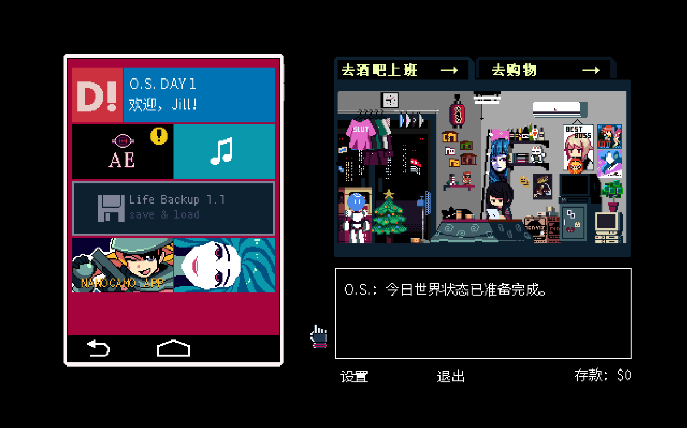
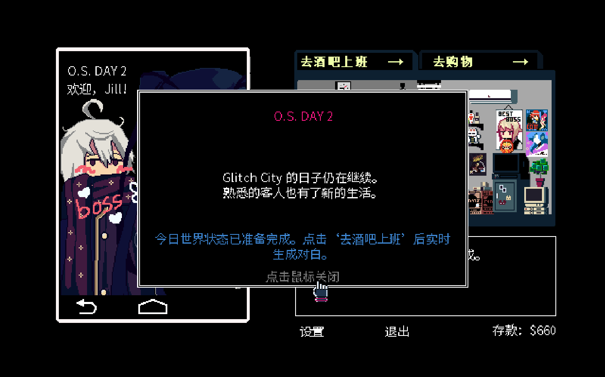
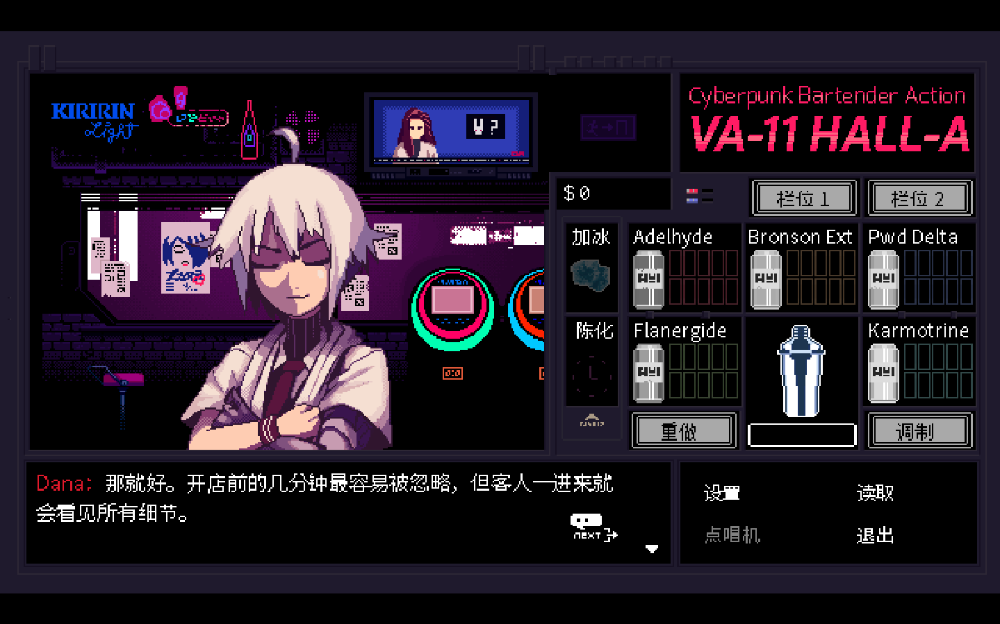
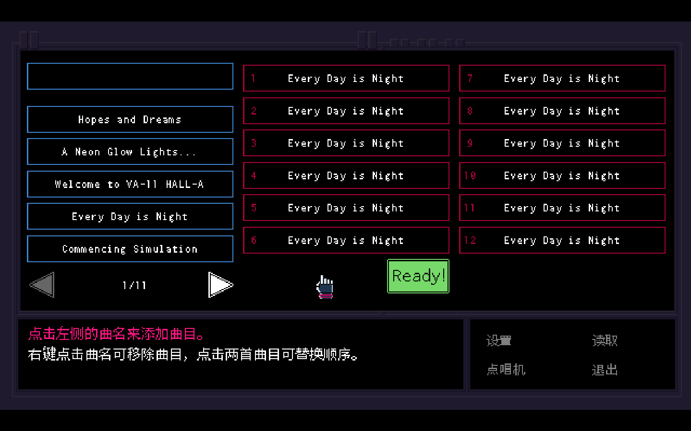
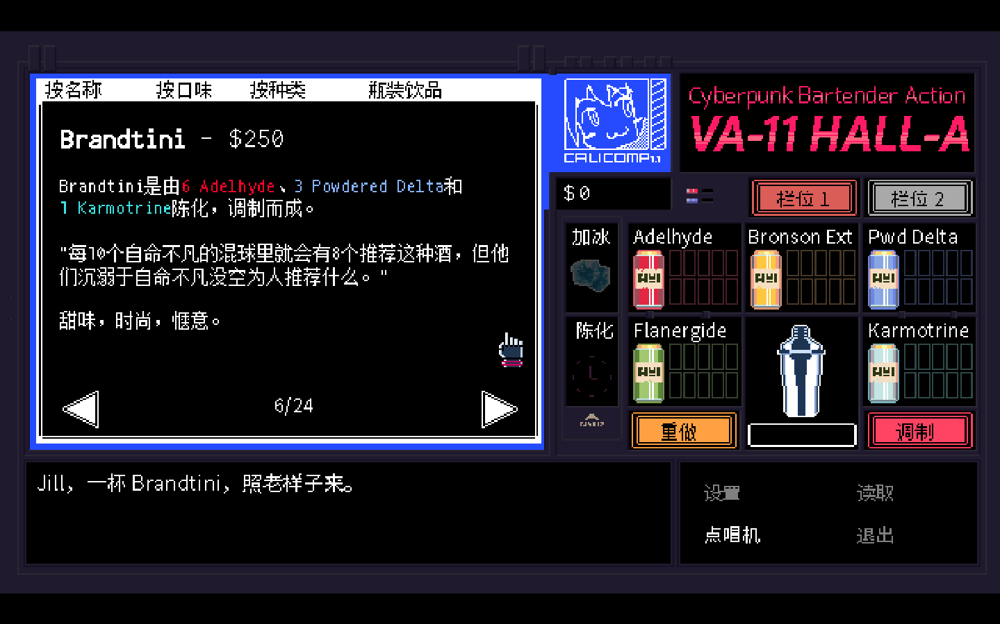
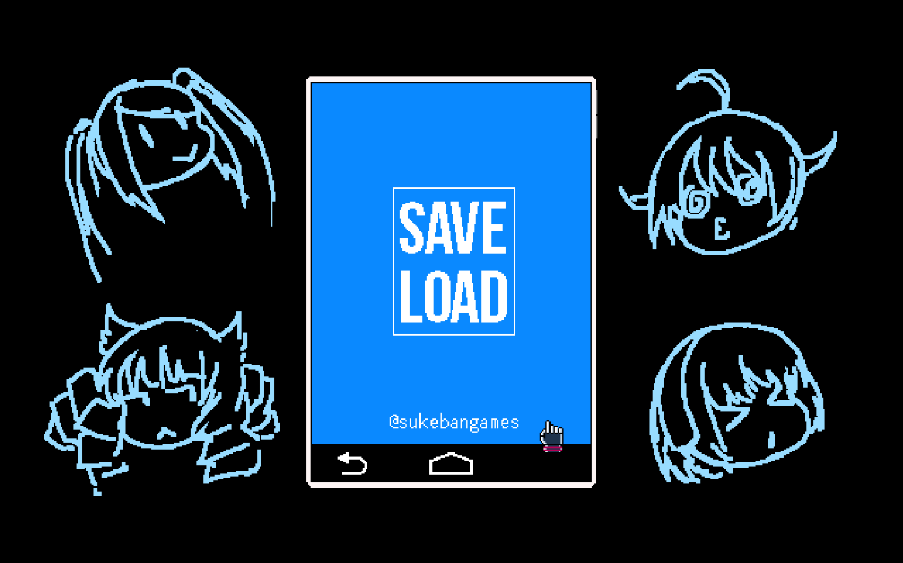

# OPEN SHIFT

OPEN SHIFT 是一个基于 VA-11 HALL-A Windows 版的社区 Mod。它发生在原版结局之后：Jill 继续在酒吧工作，而每天遇到的人和城市里的事情会慢慢发生变化。

这个项目的想法，部分来自 Coffee Talk 的 Endless Mode：酒吧经营可以一直进行下去，人物也可以在持续的对话里慢慢展开自己的生活。OPEN SHIFT 想把这种感觉放进 VA-11 HALL-A 的酒吧、调酒和像素世界里。它不是 Coffee Talk 的官方项目，也不代表原作者或发行商。

## 现在能体验什么

- 使用原版调酒器、音乐选择和存档页面；
- 在酒吧接待顾客、按订单调酒，并看到顾客的反应；
- 体验每天不同的对白和世界状态；
- 从第一天继续到第二天，并在中场休息时保存进度；
- 通过 DeepSeek 生成部分动态内容，遇到临时服务问题时使用本地规则继续游戏。

这是一个仍在开发中的 Windows 公开预览版。对话数量和人物关系还会继续调整，当前版本适合体验和反馈，不代表最终完成度。

  

  

  

  

  

## 开始游戏

目前只支持 Windows。你需要：

- 自己购买并安装的 VA-11 HALL-A Steam 版本；
- 自己的 DeepSeek API Key；
- 一台能够运行原版游戏的 Windows x64 电脑。

从 [Releases](https://github.com/KaiDecker/va11-open-shift/releases) 下载最新的 Windows 预览包，按照 [安装说明](packaging/INSTALL.md) 操作。安装过程会读取你的 Steam 游戏目录，并在另一个目录创建隔离副本；Steam 原版文件不会被修改。

## 遇到问题

如果安装失败、游戏流程卡住，或者对白和原版流程明显不一致，请在 Issue 中说明：

- 使用的版本号；
- 卡在哪一天、哪个房间或哪一步；
- 能稳定复现的操作顺序；
- 脱敏后的日志片段（不要上传 API Key）。

也可以先阅读 [安装说明](packaging/INSTALL.md) 和 [贡献指南](CONTRIBUTING.md)。

## 参与项目

欢迎提交代码、测试结果、对白建议、角色设定校对和安装体验反馈。提交 PR 前请先看 [CONTRIBUTING.md](CONTRIBUTING.md)。

## 项目边界

- 不提交或分发 Steam 原版的 `data.win`、游戏 EXE、原版资源、存档、数据库或 API Key；
- 补丁只写入 Steam 游戏的隔离副本；
- 原版台词和资源只用于研究流程与风格，不直接打包进项目；
- 动态生成的内容仍受项目规则和游戏流程约束，不会直接改写原版文件。

想了解实现方式，可以阅读 [架构说明](docs/architecture.md)、[路线图](docs/roadmap.md) 和 [后续蓝图](docs/future-blueprint.md)。维护者发布前使用的检查表在 [RELEASE_CHECKLIST.md](RELEASE_CHECKLIST.md)。
