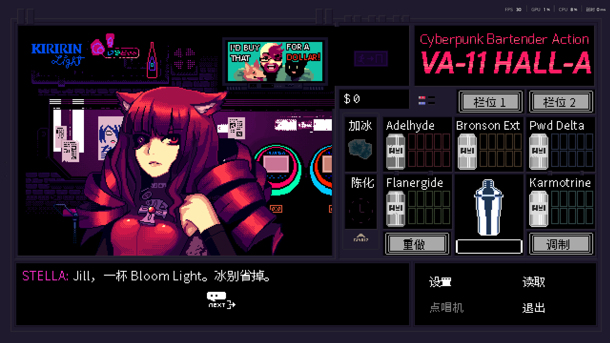
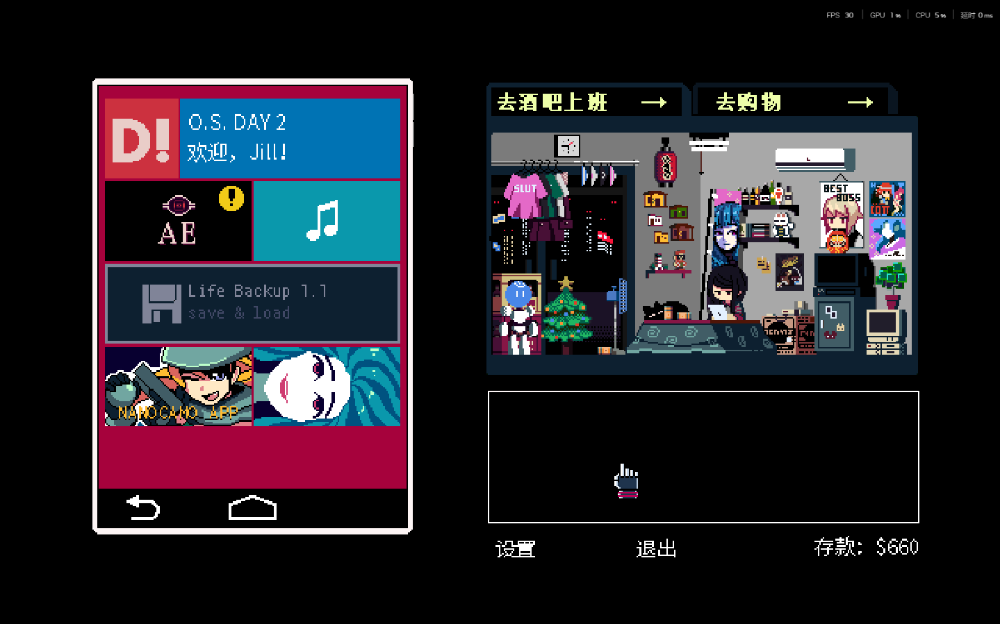
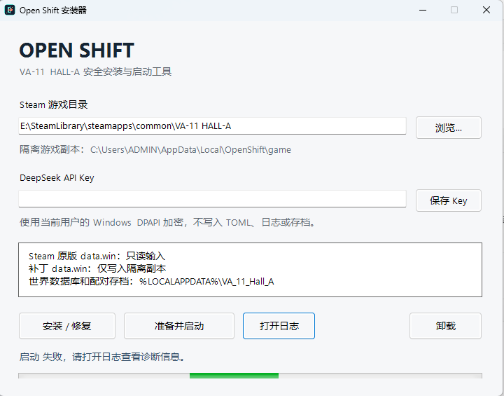

# OPEN SHIFT

一个发生在 VA-11 HALL-A 原版结局之后的长期 Agent Mod。

Jill 仍然是玩家：她决定是否去酒吧、如何调酒，以及什么时候保存。Dana、Dorothy、
Alma、Stella、Sei 等角色拥有自己的记忆、关系和生活目标；城市事件会影响酒吧对白，
也会逐步连接到 Jill 回家后的平板内容。

## 现在可以做什么

- 用原版调酒器服务顾客，按真实配方和价格结算；
- 体验每日顾客、对白、关系反应和可恢复的日循环；
- 使用中文图形化安装器，在 Steam 游戏的隔离副本中运行；
- 使用自己的 DeepSeek API Key 进行 BYOK 游戏验收。

这是一个持续开发中的社区企划，不是商业发行版。

  

## 玩家入口

从 [Releases](https://github.com/KaiDecker/va11-open-shift/releases) 下载发行包，解压后运行
`OpenShiftSetup.exe`。安装器会校验你自己的 Steam 文件、创建隔离副本并提供启动器；
Steam 原版目录不会作为写入目标。详细步骤见 [packaging/INSTALL.md](packaging/INSTALL.md)。

  

## 欢迎参与

欢迎提交角色校对、对白、城市事件、UI、GameMaker、Python、SQLite、测试和安装体验方面的
Issue 或 PR。请先阅读 [CONTRIBUTING.md](CONTRIBUTING.md)。

## 项目边界

- 不提交或分发 Steam 原版 `data.win`、游戏 EXE、原版资源、数据库或 API Key；
- 不直接搬用参考 Mod 的剧情、对白或世界设定；
- 所有补丁只写入隔离副本，原版角色核心和玩家决定权保持不变。

技术架构和长期规划： [architecture.md](docs/architecture.md) · [roadmap.md](docs/roadmap.md) ·
[future-blueprint.md](docs/future-blueprint.md)。
